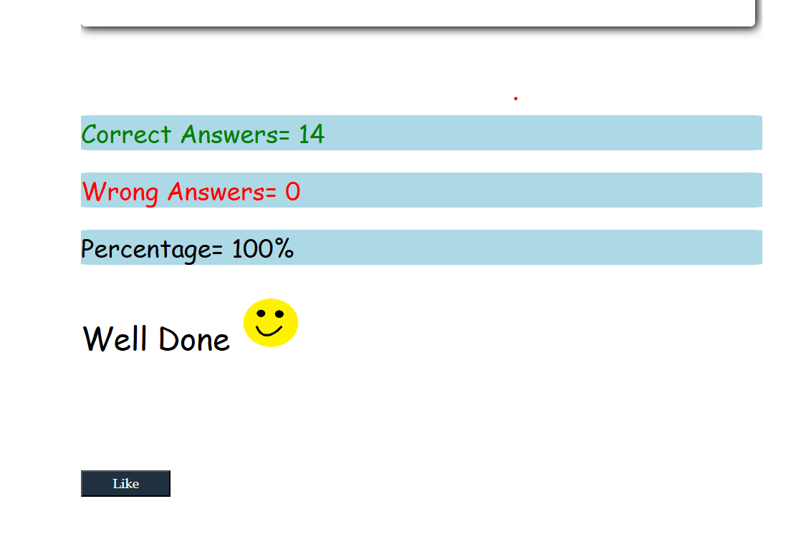

JavaScript
Assignment 1

#1. Who is the founder of JavaScript and when?

    JavaScript was created by Brendan Eich in 1995 at Netscape.It was developed in just 10 days and originally called Mocha.

#2.	What was the first browser, and when was it released?

    The first web browser was WorldWideWeb, later renamed Nexus, created by Tim Berners-Lee.
    It was released in 1990.

#3.	Name the two dominant browsers in 2000?

    Microsoft Internet Explorer 
    Netscape Navigator   

#4.	What is ECMAScript? 

    ECMAScript is the standardized scripting language specification that JavaScript is based on.
    It defines the core features and syntax of the language, maintained by ECMA International.
   
#5.	Define syntax?

    Syntax in programming refers to the rules and structure you must follow to write code that a computer can understand and run.

#6.	What is TC39?

    TC39 is the technical committee that develops and maintains the ECMAScript standard.
    It includes members from major tech companies who propose and approve new JavaScript features.

#7.	Name different data types in JavaScript?

    Number,String,Boolean,Null,Undefined,Object

#8.	Explain primitive and non-primitive data types?

    Primitive data types are basic types that store simple values directly.
    eg:Number,bignit
    Non-primitive data types is used to store collections of values or more complex data. 
    eg:Object
    
#9.	Differentiate null and undefined?

    null means a variable has been explicitly set to have no value.
    undefined means a variable has been declared but not assigned any value.

#10.https://techno-geeks.co.in/javascript-mcq-on-data-types.html#google_vignette 

