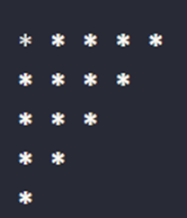
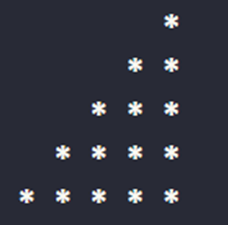
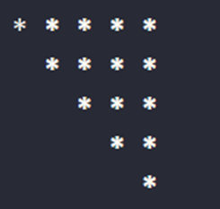
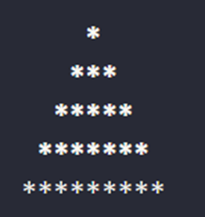
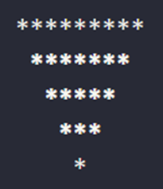
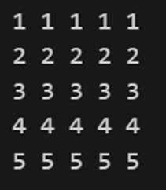
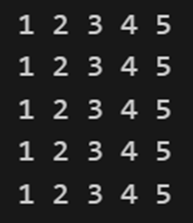
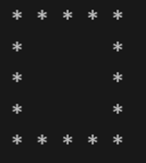

## JavaScript
## Assignment 10

# Create the below patterns using JavaScript
# 1.	Square star pattern


```
let n = 5;
let str = "";

for (let i = 1; i <= n; i++) {
    for (let j = 1; j <= n; j++) {
        str += "*";
    }
    str += "\n";
}

console.log(str);

```

# 2.	Left triangle pattern
 

 ```
 str = "";
for (let i = 1; i <= n; i++) {
    for (let j = 1; j <= i; j++) {
        str += "*";
    }
    str += "\n";
}

console.log(str);


 ```

# 3.	Inverted left triangle pattern


```
str = "";
for (let i = n; i >= 1; i--) {
    for (let j = 1; j <= i; j++) {
        str += "*";
    }
    str += "\n";
}

console.log(str);


```

# 4.	Right angle pattern


```
str = "";
for (let i = 1; i <= n; i++) {
    for (let j = 1; j <= n; j++) {
        if (j > n - i) {
            str += "*";
        } else {
            str += " ";
        }
    }
    str += "\n";
}

console.log(str);

```

 
# 5.	Inverted right angle pattern


```
str = "";
for (let i = n; i >= 1; i--) {
    for (let j = 1; j <= n; j++) {
        if (j > n - i) {
            str += "*";
        } else {
            str += " ";
        }
    }
    str += "\n";
}

console.log(str);

```
 
# 6.	Pyramid


```
str = "";
for (let i = 1; i <= n; i++) {
    for (let j = 1; j <= n - i; j++) {
        str += " ";
    }
    for (let k = 1; k <= 2 * i - 1; k++) {
        str += "*";
    }
    str += "\n";
}

console.log(str);

```
 
# 7.	Inverted pyramid


```
str = "";
for (let i = n; i >= 1; i--) {
    for (let j = 1; j <= n - i; j++) {
        str += " ";
    }
    for (let k = 1; k <= 2 * i - 1; k++) {
        str += "*";
    }
    str += "\n";
}

console.log(str);

```
 


# 8.	Square number pattern
 
 
 ```
 str = "";
for (let i = 1; i <= n; i++) {
    for (let j = 1; j <= n; j++) {
        str += i;
    }
    str += "\n";
}

console.log(str);

 ```
 
# 9.	Square number pattern


```
str = "";
for (let i = 1; i <= n; i++) {
    for (let j = 1; j <= n; j++) {
        str += j;
    }
    str += "\n";
}

console.log(str);

```
 
# 10. hollow square pattern


```
str = "";
for (let i = 1; i <= n; i++) {
    for (let j = 1; j <= n; j++) {
        if (i === 1 || i === n || j === 1 || j === n) {
            str += "*";
        } else {
            str += " ";
        }
    }
    str += "\n";
}

console.log(str);

```
 

