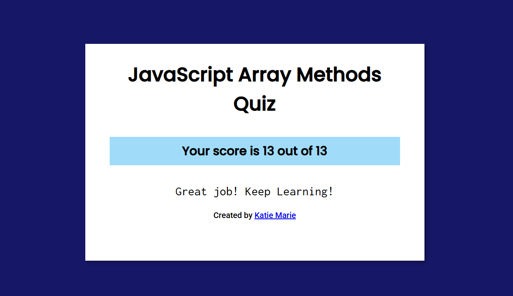

## JavaScript
## Assignment 8

# 1.	Write short notes on the following Array methods with code examples
# •	filter()
Creates a new array containing all elements of the original array for which a provided callback function returns true.
```
const numbers = [1, 2, 3, 4, 5];
const evens = numbers.filter(num => num % 2 === 0);
console.log(evens); 
console.log(numbers); 
```
# •	some()
Tests whether at least one element in the array passes the test implemented by the provided function. Returns a Boolean.
```
const names = ["Alice", "Bob", "Charlie"];
const hasShortName = names.some(name => name.length <= 3);
console.log(hasShortName); 

```
# •	every()
Tests whether all elements in the array pass the test implemented by the provided function. Returns a Boolean.
```
const grades = [92, 85, 88, 79];
const allAbove70 = grades.every(g => g > 70);
console.log(allAbove70);
const allAbove80 = grades.every(g => g > 80);
console.log(allAbove80); 

```
# •	map()
Creates a new array by calling a provided function on every element in the original array.
```
const numbers = [1, 2, 3];
const squares = numbers.map(n => n * n);
console.log(squares); 

```
# •	forEach()
Executes a provided function once for each array element. Use it when you want to perform side-effects (logging, modifying external state) rather than produce a new array.
```
const fruits = ["apple", "banana", "cherry"];
fruits.forEach((fruit, idx) => {
  console.log(`${idx}: ${fruit}`);
});

```
# •	reduce()
Executes a reducer function on each element of the array, resulting in a single output value. It can also often produce other types like objects, arrays, etc.
```
const numbers = [1, 2, 3, 4];
const sum = numbers.reduce((acc, curr) => acc + curr, 0);
console.log(sum); // 10

const people = [
  {name: "Alice", age: 21},
  {name: "Bob", age: 25},
  {name: "Charlie", age: 21}
];
const groupedByAge = people.reduce((acc, person) => {
  (acc[person.age] = acc[person.age] || []).push(person);
  return acc;
}, {});
console.log(groupedByAge);

```
# •	indexOf()
Returns the first index at which a given element can be found in the array, or -1 if it is not present.
```
const letters = ['a', 'b', 'c', 'd', 'b'];
console.log(letters.indexOf('b')); 
console.log(letters.indexOf('b', 2)); 
console.log(letters.indexOf('z')); 

```


2.	https://javascript-array-methods-quiz.netlify.app/
   
 

